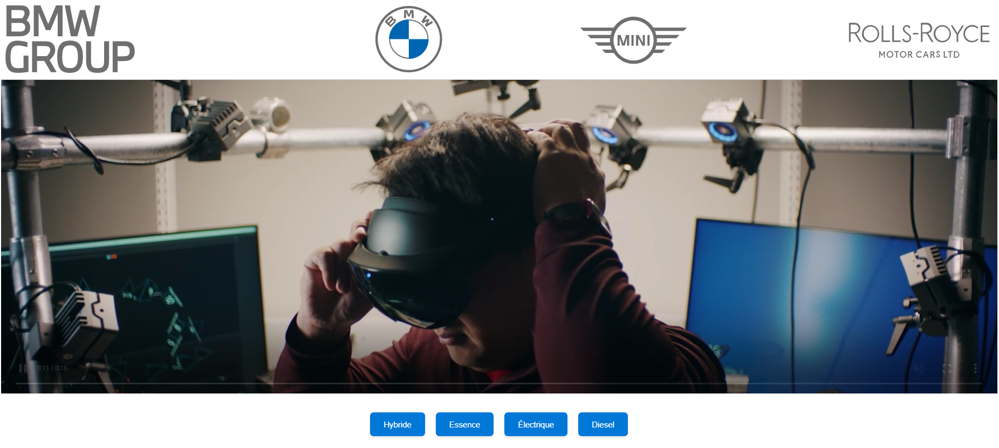
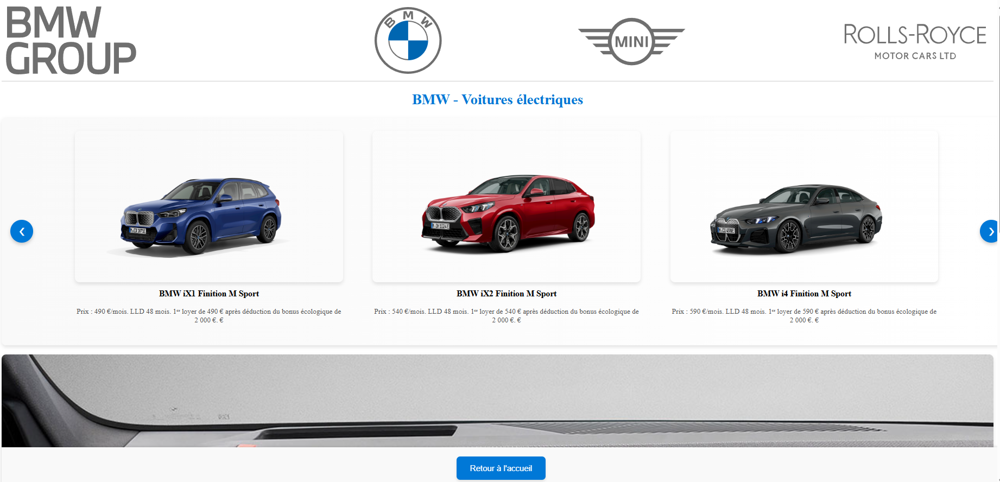
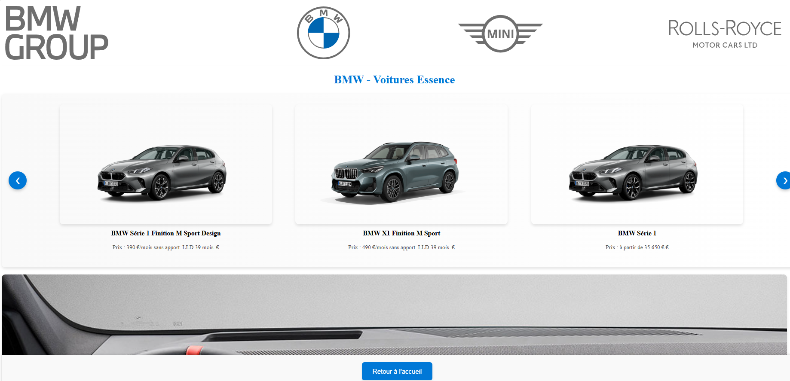
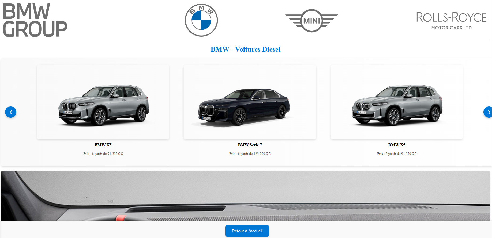
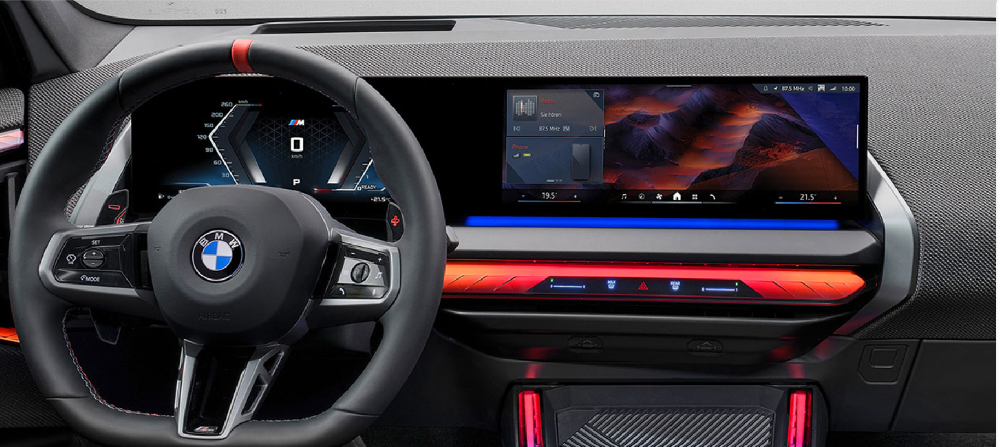

# Data Engineering - Projet GAMOUH Imad et DUONG Tony 

___

##                                                    Scraping du site BMW                                                            ##

___

Ce projet vise à récupérer tous les modèles automobiles de BMW et à les afficher sur notre propre interface. Pour ce faire, il repose sur trois services orchestrés de manière complémentaire :

**1. Scraper :**
Le conteneur Scrapy exécute des spiders pour collecter des données relatives aux modèles BMW, ainsi que des vidéos et des logos. Ces informations sont ensuite insérées dans la base de données MongoDB.

**2. MongoDB :**
Cette base de données stocke toutes les données scrappées, organisées en collections telles que bmw_models pour les modèles automobiles et bmw_videos pour les éléments multimédias (vidéos, logos).

**3. Dash :**
L'interface développée avec Dash récupère dynamiquement les données depuis MongoDB afin de les afficher dans un dashboard interactif.


## 1. Prérequis ##


#### 1. Docker ####

Docker est essentiel pour exécuter les services (scraping, MongoDB, et Dash) dans des conteneurs isolés : il permet à chaque service de disposer de son propre environnement avec toutes ses dépendances, garantissant ainsi qu'il fonctionne de la même manière sur n'importe quelle machine. En résumé, Docker rend le système plus stable, portable et facile à maintenir.

#### 2. Git ####

Git est nécessaire pour cloner le projet depuis un repository : il permet de copier l'intégralité du projet sur son ordinateur. 
Pour pouvoir cloner le répertoire, on se place dans le répertoire ou l'on souhaite cloner le programme puis on exécute la commande dans le bash :

`cd <Adresse du répertoire>`

Ensuite, on exécute la commande suivante dans le bash : 

`git clone <https://github.com/idddgg/DSIA-4201C>`

Félicitations ! Le projet a été cloné avec succès. Les prochaines étapes consisteront à rendre le site pleinement fonctionnel. On se  déplace à présent dans un répertoire spécifique du projet cloné afin de lancer le site en tapant la commande :

`cd 6Evaluation\Projet`

Nous pouvons enfin lancer le projet et accéder à notre merveilleux site. Pour cela, on exécute la commande suivante à l'aide de Docker Compose : c'est un outil qui permet de définir et de lancer plusieurs conteneurs Docker en même temps à partir d’un seul fichier.                                                                                                                                En résumé, il permet de démarrer tous les services nécessaires à notre application (Le scraping, MongoDB et Dash) avec une seule commande, tout en s'assurant qu’ils fonctionnent ensemble correctement.

`docker-compose up --build`

Après cette étape, tout sera compilé. Il ne reste plus qu'à visualiser en exécutant la commande suivante dans son navigateur ou on saisit l'URL suivante pour accéder au site :

http://127.0.0.1:8050/

Il peut arriver que l'interface Dash ne s'affiche pas correctement. Dans ce cas, il suffit de redémarrer le service Dash à l'aide de la commande suivante :

`docker-compose restart dash`

Ensuite, actualisez la page du site qui devrait s'afficher correctement. Voici quelques commandes supplémentaires pour Docker :                     

*Construire et lancer tous les services :*
`docker-compose up --build`

*Vérifier les logs des conteneurs :*
`docker-compose logs -f`

*Arrêter tous les services :*
`docker-compose down`

#### 3. Interface du site #### 

En accédant à la page principale du site, on découvre une vidéo représentant l’élégance et l’innovation de BMW.


# - Page d'accueil #



Quatre boutons sont ensuite affichés en dessous cette vidéo, représentant les types de véhicules actuellement disponibles sur le marché BMW.                                                                                                                                  En cliquant sur l’un de ces boutons, on est redirigé vers une page dédiée au type de carburant sélectionné. Sur cette page, tous les modèles correspondants sont présentés, avec une image du véhicule et des informations détaillées, telles que le prix. Il est possible de naviguer entre les modèles à l’aide de deux boutons situés sur les côtés. 


# - Page des véhicules Electriques #



# - Page des véhicules Essences # 



# - Page des véhicules Diesel #



# - Page des véhicules Hybrides #


Enfin, une image située en bas de la page met en avant la qualité remarquable des intérieurs BMW.


# - Design intérieur BMW #


Une vidéo *Video.mkv* disponible à la racine du projet est disponible montrant toutes les fonctionnalités du site.

## Partie Technique ##

### A. Scraping ###

Le service **Scrapy** collecte des données sur le site web BMW et les envoie à MongoDB. Les spiders permettent une extraction ciblée et efficace :

1. ***bmw_models*** : Ce spider xtrait les modèles, types de carburant, prix et images directement depuis le HTML des pages.

2. ***bmw_video*** : Ce spider récupère une vidéo promotionnelle.

3. ***bmw_electric_video*** et ***bmw_specific_image*** : Ce spider scrape des logos et des images depuis certaines pages, en combinant utilisant Selenium pour gérer les contenus dynamiques.

Chaque spider peut être exécuté individuellement :

`docker-compose run scraper scrapy crawl <nom_du_spider>`

Cette combinaison de **Scrapy** pour les contenus statiques et de **Selenium** pour les contenus dynamiques permet une grande flexibilité , adaptée aux différents types de données scrapées. Une fois scrapée, le **pipeline** Scrapy insère les données dans deux collections MongoDB :

1. ***bmw_models*** pour les modèles de voitures. 

2. ***bmw_videos*** pour les vidéos,images et logos.

Les fichiers de pipelines et de spiders sont conçus pour être hautement configurables, permettant une adaptation rapide pour d'autres types de données ou sites web.                                                                                                                                    Par exemple, chaque spider est isolé dans son propre fichier, ce qui facilite les modifications ou ajouts futurs.
Ainsi, on peut retenir les éléments suivants sur la partie Scraping:

- Flexibilité : Le projet gère à la fois des contenus HTML statiques et des contenus dynamiques grâce à Selenium.

- Organisation : Chaque spider est contenu dans un fichier distinct, rendant les ajustements rapides et intuitifs.

- Évolutivité : Ajouter de nouvelles cibles ou adapter les spiders existants est simplifié grâce à la structure modulaire du projet.

___

### B. Stockage des données scrapées (à l'aide de MongoDB) ###

**MongoDB** joue un rôle clé dans ce projet en stockant deux types principaux de données scrappées :                                    

- Les modèles de voitures et leurs caractéristiques.
- Les URL des images et des vidéos.

Contrairement aux bases de données classiques qui stockent localement des fichiers, ici nous avons opté pour une approche basée sur les URLs. Cette solution permet :

1. Une gestion optimisée du stockage local, car aucun fichier image ou vidéo n’est enregistré localement.

2. Une mise à jour automatique des médias affichés sans nécessiter de duplication de données.

3. Une meilleure scalabilité puisque le stockage des fichiers est externalisé sur des serveurs distants.

Ainsi, comme cité précédemment, on a plusieurs collections :

- bmw_models : Cette collection conserve les détails complets des modèles BMW, y compris leurs noms, types de carburant, prix, et URL des images associées. Par exemple, voici un aperçu respectif de la collection ***bmw_models*** et ***bmw_videos*** :

`{
    "model": "BMW i4",
    "fuel_type": "électrique",
    "price": "à partir de 55 900 €",
    "image_url": "https://bmw.fr/image.jpg"
}`

`{
    "video_url": "https://bmwgroup.com/vidéo.mp4"
}`

Grâce à ce système, les médias sont accessibles en temps réel et l’affichage des modèles et des vidéos est instantané, et tout changement côté serveur distant est immédiatement répercuté sur l’interface **Dash**.
Ainsi, le déploiement de **MongoDB** via **Docker** permet le stockage de données dans un volume, garantissant que les données restent accessibles même après un redémarrage :

`volumes:
  dbdata:/data/db
`

Avec cette approche, le projet bénéficie d’une gestion efficace des ressources, et permet d'éviter les contraintes de stockage local et assure un affichage rapide et dynamique des contenus.

___

### C. Affichage (à l'aide de Dash) ###

**Dash** offre une interface utilisateur dynamique pour visualiser les données scrappées. L'architecture du code a été pensée pour faciliter la maintenance et l'évolution en séparant chaque composant clé dans des scripts dédiés. On peut voir ainsi un exemple de l'architecture modulaire :

- *header.py* : Gère l'affichage dynamique de l'en-tête avec les logos récupérés depuis MongoDB.

- *footer.py* : Contient le pied de page et les boutons de navigation globaux.

- *main_content.py* : Page d'accueil affichant une vidéo et les liens vers les différentes catégories de véhicules.

Un script EST dédié pour chaque type de véhicule (electrique.py, diesel.py, essence.py, hybride.py) : il permet de récupèrer dynamiquement les modèles depuis MongoDB, de génèrer une mise en page spécifique pour chaque catégorie.

- *def.py* : Centralise la gestion du **carrousel interactif** et facilite la navigation entre les images. On peut retrouver également ci-dessous par exemple une partie du script qui permet ainsi de naviguer entre les images des modèles BMW :                              
```def create_carousel(fuel_type):
    cars = get_cars_by_fuel_type(fuel_type)
    
    if not cars:
        return html.P("Aucune voiture disponible pour ce type de carburant.", style={"textAlign": "center", "fontSize": "18px"})
    
    return html.Div([
        dcc.Store(id='current-image-index', data=0),
        
        html.Div(
            style={
                'position': 'relative',
                'width': '800px',
                'height': '450px',
                'margin': '0 auto',
                'borderRadius': '10px',
                'overflow': 'hidden',
                'boxShadow': '0px 4px 8px rgba(0, 0, 0, 0.2)'
            },
            children=[
                html.Img(
                    id='displayed-image',
                    src=cars[0]['image_url'],
                    style={'width': '100%', 'height': '100%', 'objectFit': 'cover', 'borderRadius': '10px'}
                ),
                
                html.Button(
                    "❮",
                    id='prev-button',
                    n_clicks=0,
                    style={
                        'position': 'absolute',
                        'top': '50%',
                        'left': '10px',
                        'transform': 'translateY(-50%)',
                        'fontSize': '24px',
                        'backgroundColor': 'white',
                        'border': 'none',
                        'borderRadius': '50%',
                        'width': '40px',
                        'height': '40px',
                        'cursor': 'pointer',
                        'opacity': '0.8'
                    }
                ),
                
                html.Button(
                    "❯",
                    id='next-button',
                    n_clicks=0,
                    style={
                        'position': 'absolute',
                        'top': '50%',
                        'right': '10px',
                        'transform': 'translateY(-50%)',
                        'fontSize': '24px',
                        'backgroundColor': 'white',
                        'border': 'none',
                        'borderRadius': '50%',
                        'width': '40px',
                        'height': '40px',
                        'cursor': 'pointer',
                        'opacity': '0.8'
                    }
                ),
            ]
        ),
    ], style={'textAlign': 'center'})

     # Callback pour gérer la navigation dans le carrousel

 def register_callbacks(app, fuel_type):
    @app.callback(
        Output('current-image-index', 'data'),
        Input('prev-button', 'n_clicks'),
        Input('next-button', 'n_clicks'),
        prevent_initial_call=True
    )
    def update_image_index(prev_clicks, next_clicks):
        cars = get_cars_by_fuel_type(fuel_type)
        total_images = len(cars)
        changed_id = [p['prop_id'] for p in app.callback_context.triggered][0]
        
        if 'prev-button' in changed_id:
            return (prev_clicks - 1) % total_images
        elif 'next-button' in changed_id:
            return (next_clicks + 1) % total_images
        return 0
    
    @app.callback(
        Output('displayed-image', 'src'),
        Input('current-image-index', 'data')
    )
    def display_current_image(image_index):
        cars = get_cars_by_fuel_type(fuel_type)
        return cars[image_index]['image_url']
```

L’ensemble des données est géré par le fichier *database.py*, qui centralise les interactions avec la base MongoDB et permet de récupérer dynamiquement les informations nécessaires pour alimenter les différentes pages du site.

Avec les autres scripts, ils permettent d'avoir une approche modulaire garantissant une certaine flexibilité et permettant d'ajouter ou de modifier facilement une catégorie sans impacter l'ensemble du projet.

___

Globalement, ce projet permet de récupérer les données de BMW tout en gardant une architecture moderne et un code bien structuré.

